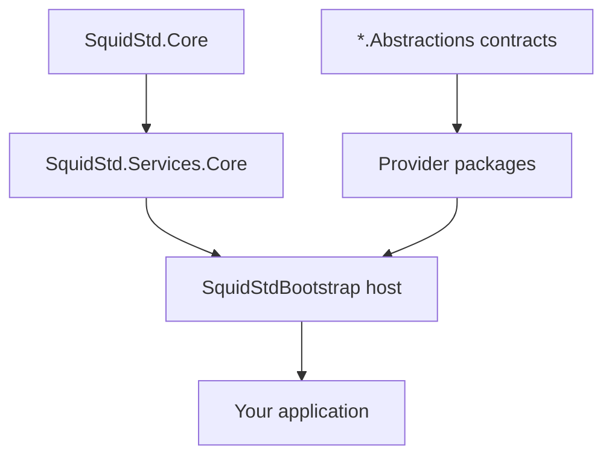

# Architecture

SquidStd is a modular .NET toolkit. Rather than a single monolithic library, it ships one package per capability, so an application depends only on the pieces it actually uses.

## Modular by design

Every capability is split in two: an `*.Abstractions` package that holds the contracts (interfaces and DTOs) and one or more provider packages that implement them. For example `SquidStd.Messaging.Abstractions` defines the messaging contracts, while `SquidStd.Messaging`, `SquidStd.Messaging.RabbitMq`, and `SquidStd.Messaging.Sqs` provide implementations. This keeps call sites coupled to contracts, not to a concrete backend. See [abstractions first](abstractions-first.md) for why this matters.

## Layers

The dependency flow runs in one direction:

- **Core** (`SquidStd.Core`) — primitives, options, and the building blocks everything else sits on.
- **Abstractions** — per-capability contract packages.
- **Providers** — concrete implementations of those contracts.
- **Host** — `SquidStdBootstrap` composes services and runs them.

Higher layers depend on lower ones, never the reverse.

## Package graph

## Next

- [Bootstrap lifecycle](bootstrap-lifecycle.md) — how the host starts and stops services.
- [Abstractions first](abstractions-first.md) — the contract-plus-provider pattern in depth.
