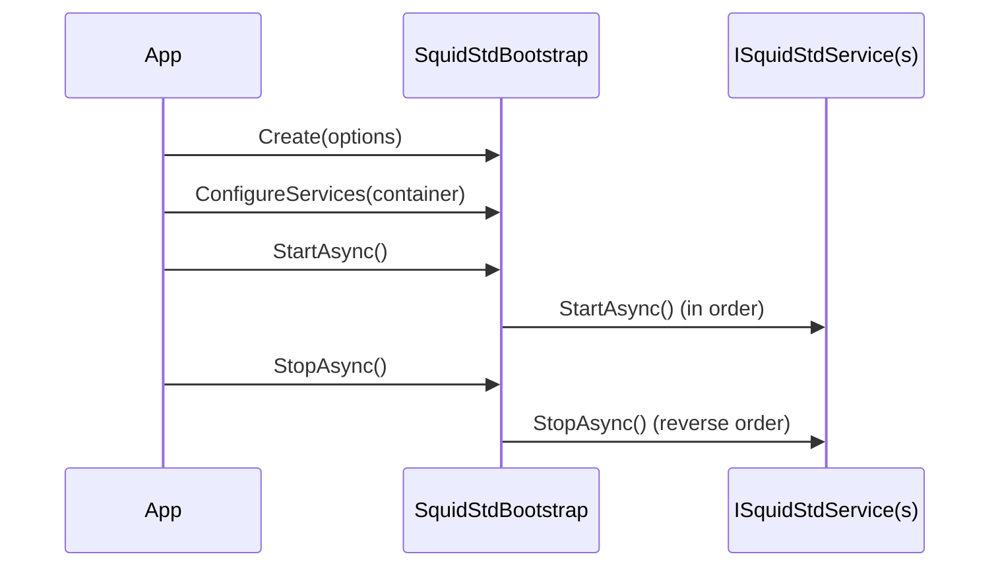

# Bootstrap lifecycle

`SquidStdBootstrap` is the entry point that wires up dependency injection and drives the lifecycle of every registered service. The flow is always the same: create, configure, start, stop.

## Create

Begin by creating the bootstrap from `SquidStdOptions`:

```csharp
var bootstrap = SquidStdBootstrap.Create(new SquidStdOptions
{
    ConfigName = "squidstd",
    RootDirectory = AppContext.BaseDirectory
});
```

`ConfigName` selects the configuration file and `RootDirectory` anchors relative paths. `Create`
loads the configuration eagerly - the YAML file, or an empty document when it does not exist
yet - into a standalone `SquidStdConfig`, before any service registration happens. It also
registers the configuration core: `DirectoriesConfig`, the `logger` config section (bound
immediately against that `SquidStdConfig`) and the config manager. Everything else is
registered explicitly in `ConfigureServices`. To supply an already-loaded configuration
yourself - useful when values from the file must drive registration decisions - use the
`Create(SquidStdConfig, SquidStdOptions)` overload; see
[two-phase setup](../guides/configuration.md#two-phase-setup-moongate-style).

## Managed directories

`SquidStdOptions.Directories` declares directory names that are created under `RootDirectory` as soon
as `Create` runs, before `ConfigureServices` or `StartAsync`:

```csharp
var bootstrap = SquidStdBootstrap.Create(new SquidStdOptions
{
    ConfigName = "squidstd",
    RootDirectory = AppContext.BaseDirectory,
    Directories = ["scripts", "save"]
});
```

Modules and plugins that need their own managed directory register it against the same
`DirectoriesConfig` instance, resolved from the container:

```csharp
var directories = bootstrap.Container.Resolve<DirectoriesConfig>();
var worldDir = directories.RegisterDirectory("world");
```

Directory names are lower-cased to snake_case on disk (`SavedGames` becomes `saved_games`), and
`RegisterDirectory` is idempotent - registering the same name again just returns the existing path
without creating it twice.

## ConfigureServices

Register your services into the DryIoc container. Call `RegisterCoreServices()` first to bring up the core services, then add the modules you need:

```csharp
bootstrap.ConfigureServices(container =>
{
    return container
        .RegisterCoreServices()
        .AddSomething();
});
```

Config bound at registration: every `RegisterConfigSection` call inside this callback - direct,
or through a `RegisterXxx`/`AddXxx` helper - binds its section immediately, so the section
instance is resolvable as soon as the callback returns. There is no need to wait for
`StartAsync`.

See [dependency injection](dependency-injection.md) for the container and the `AddXxx` / `RegisterXxx` pattern.

## OnConfigLoaded

Once, at `StartAsync` - before the logger is built and services start - the bootstrap applies
any typed config hooks you registered. Use them to inspect or override the already-bound
sections at startup; changes are in-memory only:

```csharp
var bootstrap = SquidStdBootstrap.Create(o => o.ConfigName = "myapp");
bootstrap.ConfigureServices(c => c.RegisterCoreServices());
bootstrap.OnConfigLoaded<SquidStdLoggerOptions>(o => o.MinimumLevel = LogLevelType.Debug);

await bootstrap.StartAsync();
```

The effective order is: sections bind at registration (during `ConfigureServices`), config
hooks apply once at `StartAsync` entry, the logger is configured, then services start. Hooks
are re-applied whenever you call `IConfigManagerService.Load()` for an explicit reload, so
overrides are never lost across a reload. To receive the whole configuration manager once
every typed hook has run, use `bootstrap.OnConfigReady(cfg => ...)`. See
[Inspecting and overriding loaded configuration](../guides/configuration.md#inspecting-and-overriding-loaded-configuration) for more examples.

## Migrating to 0.15: explicit core services

Up to 0.14, `SquidStdBootstrap.Create` registered every core service on creation. From 0.15 the bootstrap registers only the configuration core - `DirectoriesConfig`, the `logger` config section and the config manager. The remaining core services (JSON serializer, event bus, job system, main-thread dispatcher, timer wheel, metrics collection, secrets) are opted into with the parameterless `RegisterCoreServices()`:

```csharp
var bootstrap = SquidStdBootstrap.Create(o => o.ConfigName = "myapp");
bootstrap.ConfigureServices(c => c.RegisterCoreServices());
await bootstrap.StartAsync();
```

If you only need a subset, pick individual services with the granular methods instead - `RegisterEventBusService()`, `RegisterJobSystemService()`, `RegisterTimerWheelService()`, `RegisterMainThreadDispatcherService()`, `RegisterMetricsCollectionService()`, `RegisterSecretServices()`, `RegisterDataSerializer()`.

The `RegisterCoreServices(configName, configDirectory)` overload is unchanged: it registers the configuration core plus all core services, for standalone containers that do not use a bootstrap.

In ASP.NET Core, pass the registration through the container callback:

```csharp
builder.UseSquidStd(options => options.ConfigName = "myapp", c => c.RegisterCoreServices());
```

## Start and stop over ISquidStdService

Services implementing `ISquidStdService` participate in the lifecycle. On `StartAsync` the config hooks are applied once (mutating the already-bound sections in place) and, if the configuration file does not exist yet, it is written with defaults; then services are started in registration order. On `StopAsync` they are stopped in reverse order, so dependencies remain available while their dependents shut down.

The bootstrap logs its whole lifecycle: a startup banner with the application name and version (set `SquidStdOptions.AppName`; it defaults to the entry assembly name and is attached to every event as the `Application` / `ApplicationVersion` properties), a registration summary (per-registration detail at Debug), one line per service started with its duration, and the shutdown sequence. A service that fails to stop is logged as a warning and the remaining services are still stopped. Extra Serilog sinks can be plugged by registering `ILogEventSink` instances in the container before start.

When an event bus is registered, the bootstrap publishes `EngineStartingEvent`, `EngineStartedEvent` and `EngineStoppedEvent` on it during the lifecycle.
`EngineStartingEvent` is only visible to subscriptions made before start - auto-registered listeners start during the service loop.



## RunAsync for long-running hosts

For long-running hosts, call `RunAsync`. It starts every service and then blocks until cancellation, stopping services cleanly on shutdown. Resolve dependencies anywhere with `bootstrap.Resolve<T>()`. See the [architecture](architecture.md) overview for how the host fits the layers.

`RunAsync` also completes when a shutdown is requested through the shared lifetime - this is
what the `exit` command of SquidStd.ConsoleCommands does - and Ctrl+C performs an orderly
shutdown instead of killing the process:

```csharp
bootstrap.Container.Resolve<ISquidStdLifetime>().RequestShutdown();
```
