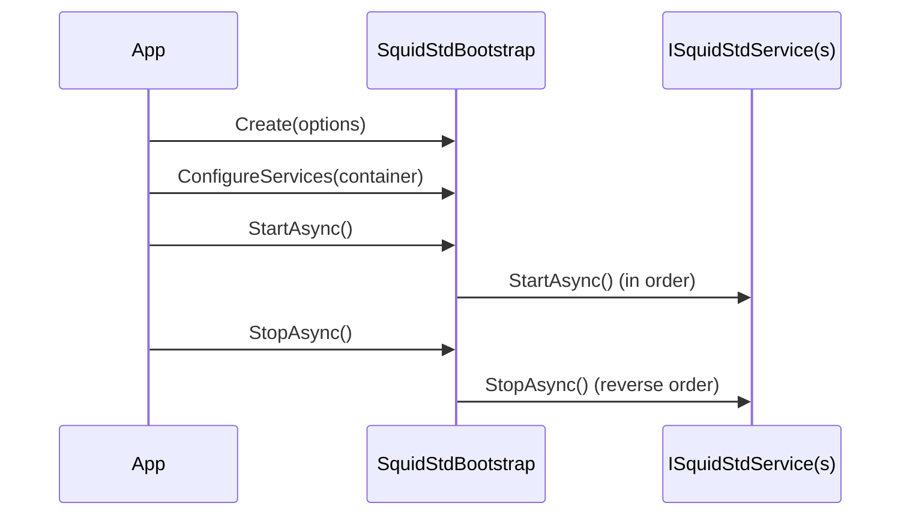

# Bootstrap lifecycle

`SquidStdBootstrap` is the entry point that wires up dependency injection and drives the lifecycle of every registered service. The flow is always the same: create, configure, start, stop.

## Create

Begin by creating the bootstrap from `SquidStdOptions`:

```csharp
var bootstrap = SquidStdBootstrap.Create(new SquidStdOptions
{
    ConfigName = "squidstd",
    RootDirectory = AppContext.BaseDirectory
});
```

`ConfigName` selects the configuration file and `RootDirectory` anchors relative paths.

## ConfigureServices

Register your services into the DryIoc container:

```csharp
bootstrap.ConfigureServices(container =>
{
    container.AddSomething();
});
```

See [dependency injection](dependency-injection.md) for the container and the `AddXxx` / `RegisterXxx` pattern.

## Start and stop over ISquidStdService

Services implementing `ISquidStdService` participate in the lifecycle. On `StartAsync` they are started in registration order; on `StopAsync` they are stopped in reverse order, so dependencies remain available while their dependents shut down.



## RunAsync for long-running hosts

For long-running hosts, call `RunAsync`. It starts every service and then blocks until cancellation, stopping services cleanly on shutdown. Resolve dependencies anywhere with `bootstrap.Resolve<T>()`. See the [architecture](architecture.md) overview for how the host fits the layers.
