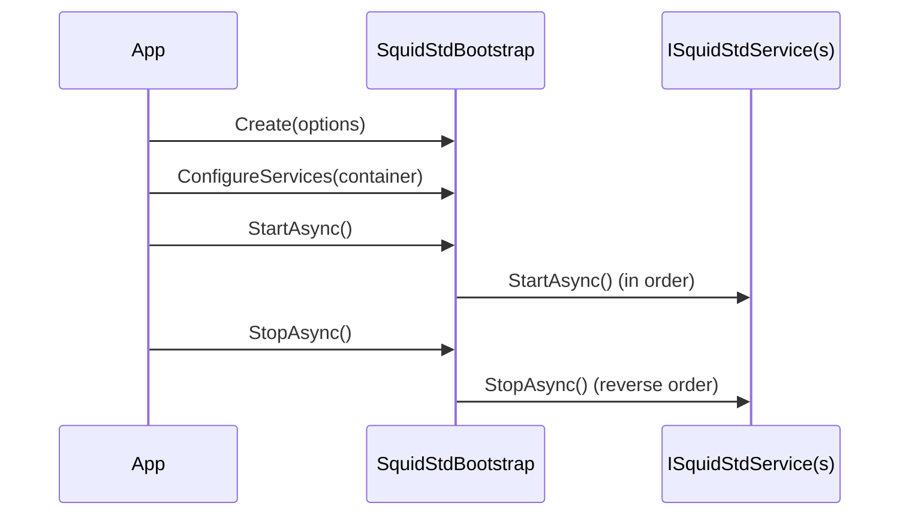

# Bootstrap lifecycle

`SquidStdBootstrap` is the entry point that wires up dependency injection and drives the lifecycle of every registered service. The flow is always the same: create, configure, start, stop.

## Create

Begin by creating the bootstrap from `SquidStdOptions`:

```csharp
var bootstrap = SquidStdBootstrap.Create(new SquidStdOptions
{
    ConfigName = "squidstd",
    RootDirectory = AppContext.BaseDirectory
});
```

`ConfigName` selects the configuration file and `RootDirectory` anchors relative paths. Creating the bootstrap registers the configuration core - `DirectoriesConfig`, the `logger` config section and the config manager. Everything else is registered explicitly in `ConfigureServices`.

## ConfigureServices

Register your services into the DryIoc container. Call `RegisterCoreServices()` first to bring up the core services, then add the modules you need:

```csharp
bootstrap.ConfigureServices(container =>
{
    return container
        .RegisterCoreServices()
        .AddSomething();
});
```

See [dependency injection](dependency-injection.md) for the container and the `AddXxx` / `RegisterXxx` pattern.

## Migrating to 0.15: explicit core services

Up to 0.14, `SquidStdBootstrap.Create` registered every core service on creation. From 0.15 the bootstrap registers only the configuration core - `DirectoriesConfig`, the `logger` config section and the config manager. The remaining core services (JSON serializer, event bus, job system, main-thread dispatcher, timer wheel, metrics collection, secrets) are opted into with the parameterless `RegisterCoreServices()`:

```csharp
var bootstrap = SquidStdBootstrap.Create(o => o.ConfigName = "myapp");
bootstrap.ConfigureServices(c => c.RegisterCoreServices());
await bootstrap.StartAsync();
```

If you only need a subset, pick individual services with the granular methods instead - `RegisterEventBusService()`, `RegisterJobSystemService()`, `RegisterTimerWheelService()`, `RegisterMainThreadDispatcherService()`, `RegisterMetricsCollectionService()`, `RegisterSecretServices()`, `RegisterDataSerializer()`.

The `RegisterCoreServices(configName, configDirectory)` overload is unchanged: it registers the configuration core plus all core services, for standalone containers that do not use a bootstrap.

In ASP.NET Core, pass the registration through the container callback:

```csharp
builder.UseSquidStd(options => options.ConfigName = "myapp", c => c.RegisterCoreServices());
```

## Start and stop over ISquidStdService

Services implementing `ISquidStdService` participate in the lifecycle. On `StartAsync` they are started in registration order; on `StopAsync` they are stopped in reverse order, so dependencies remain available while their dependents shut down.

The bootstrap logs its whole lifecycle: a startup banner with the application name and version (set `SquidStdOptions.AppName`; it defaults to the entry assembly name and is attached to every event as the `Application` / `ApplicationVersion` properties), a registration summary (per-registration detail at Debug), one line per service started with its duration, and the shutdown sequence. A service that fails to stop is logged as a warning and the remaining services are still stopped. Extra Serilog sinks can be plugged by registering `ILogEventSink` instances in the container before start.



## RunAsync for long-running hosts

For long-running hosts, call `RunAsync`. It starts every service and then blocks until cancellation, stopping services cleanly on shutdown. Resolve dependencies anywhere with `bootstrap.Resolve<T>()`. See the [architecture](architecture.md) overview for how the host fits the layers.
