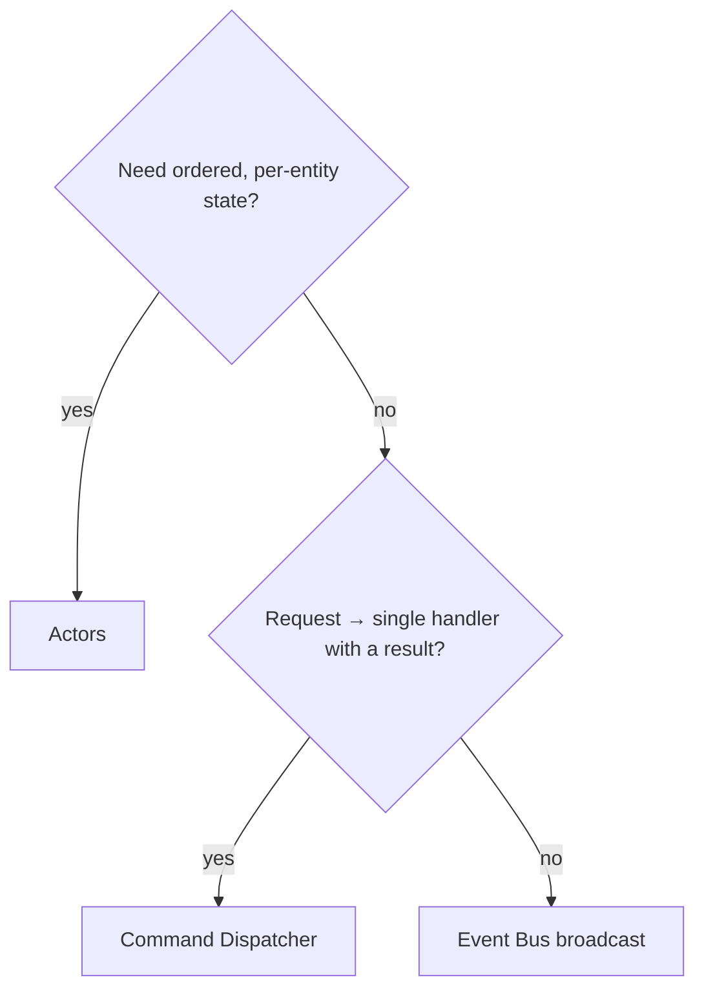

# Messaging models

SquidStd offers three in-process messaging models. Each fits a different shape of communication, and they can be mixed freely within one application.

## Event Bus

The Event Bus (`IEventBus`) is a stateless broadcast. Publishers call `PublishAsync` and any number of subscribers registered with `Subscribe` receive the event. Senders do not know who listens, and there is no return value. Use it for fan-out notifications where many parts of the system react to something that happened.

## Command Dispatcher

The Command Dispatcher is a stateless request routed to a single handler that returns a result. Unlike the Event Bus there is exactly one handler per command, and the caller awaits its result. Use it for request/response work - validating input, performing an operation, returning an outcome - where ownership of the action is unambiguous.

## Actors

Actors (`Actor<TMessage>`) provide an ordered, stateful, per-entity mailbox. Each actor processes its messages one at a time in order, so state inside an actor needs no locks. Send fire-and-forget messages with `TellAsync` or request a reply with `AskAsync`. Use actors when you need serialized access to per-entity state, such as a single account, device, or session.

## Choosing

All three are contract-first; see [abstractions first](abstractions-first.md) for swapping in external transports.
