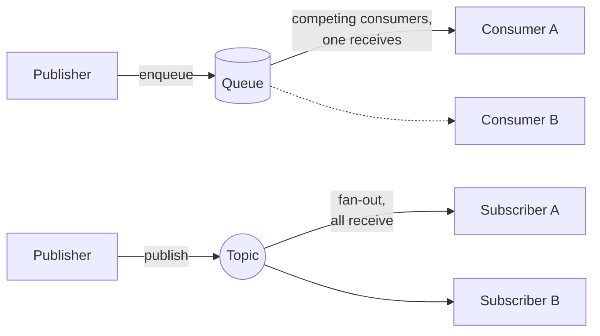

[!include]

## How messages flow

Queues deliver each message to exactly one consumer (work distribution); topics fan out every message to all subscribers (notifications). Both are behind `IMessageQueue` / `IMessageTopic` regardless of the backend.
