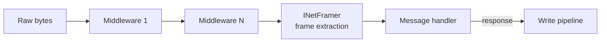

[!include]

## The receive pipeline

Each connection runs inbound bytes through the middleware chain (`INetMiddleware`), then the configured `INetFramer` splits the accumulated stream into discrete frames before they reach your handler. The write path runs the same middleware chain on outgoing payloads before the bytes hit the socket.
