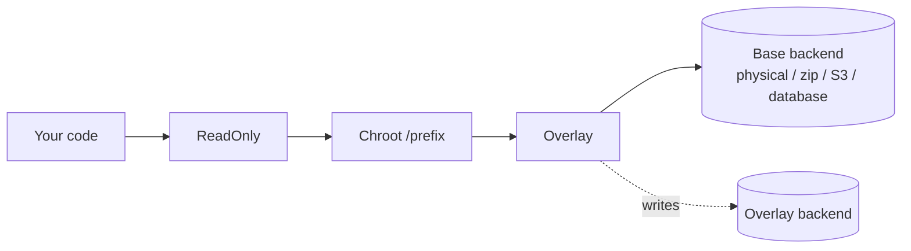

[!include]

## Decorator composition

```mermaid
flowchart LR
  App[Your code] --> RO[ReadOnly]
  RO --> CH[Chroot /prefix]
  CH --> OV[Overlay]
  OV --> Base[(Base backend<br/>physical / zip / S3 / database)]
  OV -.->|writes| Upper[(Overlay backend)]
```

Decorators wrap any `IVirtualFileSystem`: read-only guards, chroot prefixes, and overlays compose freely over the physical, zip, S3 or database backends.
